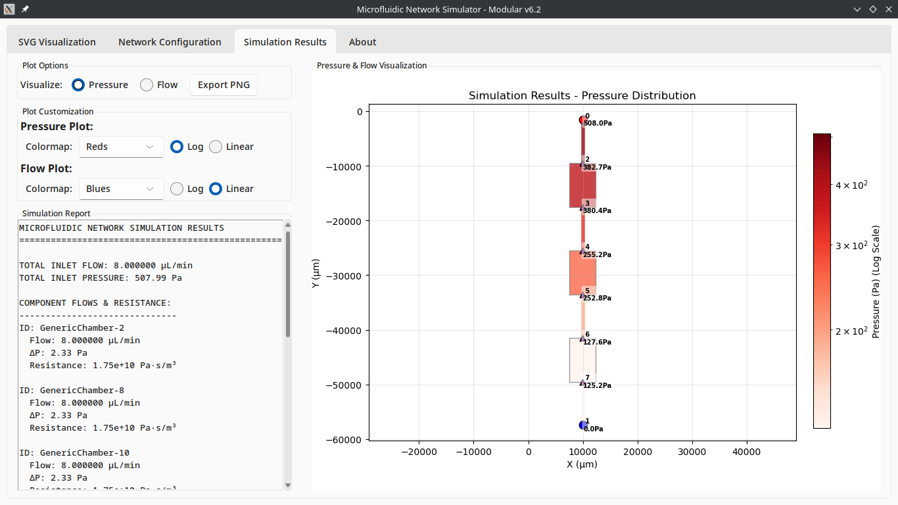

# OpenµSim: Simulador de Redes Microfluídicas

**OpenµSim** es un software de código abierto diseñado para ejecutar simulaciones rápidas y accesibles de redes microfluídicas, calculando la distribución de presión y los caudales en dispositivos compuestos por canales y cámaras. Desarrollado en el **LabµFab** (Universidad Nacional de Villa Mercedes), este simulador busca mitigar los altos requerimientos computacionales asociados a las simulaciones CFD tradicionales, democratizando el acceso a herramientas de validación de diseño en bioingeniería y fomentando la educación experimental.

## Características Principales

* **Modelo Matemático de Alta Precisión:** El núcleo de cálculo se fundamenta en un modelo de resistencia hidráulica. Emplea la solución analítica completa para el flujo de Hagen-Poiseuille en canales rectangulares (basado en Bruus, 2008, Eq. 2.45), lo que garantiza exactitud para cualquier relación de aspecto operando dentro del régimen laminar.

* **Integración Nativa con Flui3D:** El *parser* del simulador está optimizado específicamente para leer y procesar de forma directa los archivos vectoriales (SVG) generados por la plataforma web *flui3d.org*. (Nota: No se garantiza compatibilidad con archivos SVG provenientes de otras fuentes como Inkscape o Adobe Illustrator, dado que el sistema espera la estructura de datos específica de Flui3D).

* **Resultados Validados:** El desempeño del algoritmo fue validado exitosamente en su etapa de prototipo mediante análisis comparativo con *Fluidevice*, contrastando los resultados analíticos contra el modelo basado en la ecuación de Darcy-Weisbach.
* **Eficiencia Operativa:** Permite a los usuarios iterar y evaluar geometrías de red sin depender de servidores o infraestructura de cómputo de alto rendimiento.

## Origen y Créditos

Este simulador nace como una iniciativa orientada a la ciencia abierta dentro del flujo de trabajo del **LabµFab**.

* **Desarrollador Principal:** Lorenzo Tell (Estudiante Avanzado de Bioingeniería, Universidad Nacional de Villa Mercedes - LabµFab).

* **Apoyo Institucional:** Club Estudiantil de Bioingeniería (CEB).

El proyecto agradece especialmente al equipo de desarrollo de *Flui3D* (Ulf Schlichtmann, Dr. Tsun-Ming Tseng, Yushen Zhang, Mengchu Li, y colaboradores) por democratizar el diseño microfluídico y sentar las bases que inspiraron esta herramienta.

## Licencia

El código fuente y la documentación se distribuyen bajo la licencia **MIT**. El software se proporciona "tal cual", sin garantías de ningún tipo; su uso corre bajo la propia responsabilidad del usuario.
